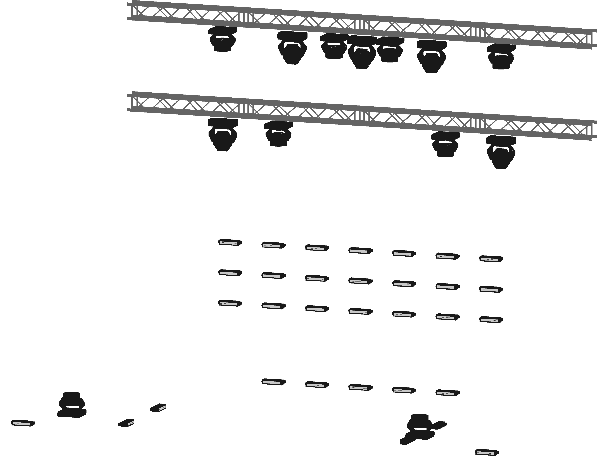
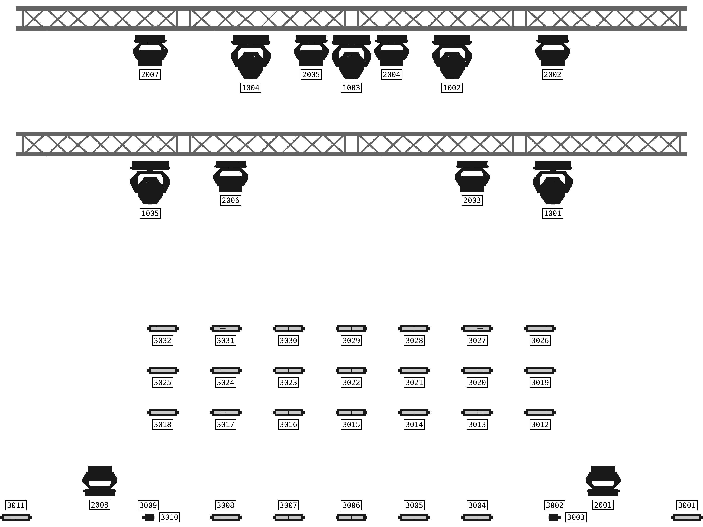

# Patch2PDF Rasterizer

This rasterizer is used for 2D renderings of stage models.

Triangle Rasterization is inspired by [this course](https://haqr.eu/tinyrenderer/) and has been enhanced with custom performance optimisations.

In addition to only drawing the stage model, labels with the corresponding fixture id can also be added.

## Configuration

Each Canvas output can be customized via the `RasterizerConfig` struct.
See below for examples

## Examples

### Without Labels

```go
RasterizerConfig{
  RenderLabels: false,
  Rotation: rasterizer.Rotation{Alpha: 10, Beta: 0, Gamma: -20},
  OverrideColors: OverrideColorMap{},
  CanvasConfig: CanvasConfig{
		Width:         4000,
		Height:        3000,
		LabelFont:     fontBytes, // raw bytes of an embedded ttf font
		LabelDPI:      300,
		LabelFontSize: 10,
	}
}
```



### With Labels

```go
RasterizerConfig{
  RenderLabels: true,
  Rotation: rasterizer.Rotation{Alpha: 0, Beta: 0, Gamma: 0},
  OverrideColors: OverrideColorMap{},
  CanvasConfig: CanvasConfig{
		Width:         4000,
		Height:        3000,
		LabelFont:     fontBytes, // raw bytes of an embedded ttf font
		LabelDPI:      300,
		LabelFontSize: 10,
	}
}
```


